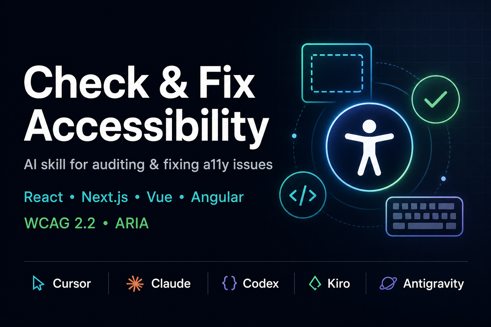

# Check and Fix Accessibility (a11y) Skill

A reusable **accessibility (a11y) skill** for AI coding assistants. It teaches the agent how to audit and fix front-end accessibility issues (WCAG 2.2 Level A/AA), including semantics, keyboard navigation, ARIA, forms, contrast, and screen readers—for web (React, Next.js, Vue, Angular) and with pointers for native mobile.

Use this skill when you or your team work on accessibility, a11y, WCAG, screen readers, keyboard navigation, focus management, ARIA, semantic HTML, or fixing accessibility issues in HTML/React/Next.js/Vue or other front-end code.



---

## Quick start

1. **Clone this repo** (replace `YOUR_USERNAME` with the GitHub org or user):

   ```bash
   git clone https://github.com/YOUR_USERNAME/check-fix-accessibility.git
   cd check-fix-accessibility
   ```

2. **Copy the `check-fix-accessibility` folder** into your assistant’s skills directory (pick your tool):

   | Assistant | Project (this repo only) | Global (all projects) |
   |-----------|--------------------------|------------------------|
   | **Cursor** | `.cursor/skills/check-fix-accessibility/` | `~/.cursor/skills/check-fix-accessibility/` |
   | **Claude Code** | `.claude/skills/check-fix-accessibility/` or `.claude/rules/` | `~/.claude/skills/check-fix-accessibility/` |
   | **Kiro** | `.kiro/skills/check-fix-accessibility/` | `~/.kiro/skills/check-fix-accessibility/` |
   | **Codex** | — | `$CODEX_HOME/skills/check-fix-accessibility/` (default `~/.codex/skills/`) |
   | **Antigravity** | `.agent/skills/check-fix-accessibility/` | `~/.gemini/antigravity/skills/check-fix-accessibility/` |

   Example (Cursor, project scope):

   ```bash
   mkdir -p .cursor/skills
   cp -r check-fix-accessibility .cursor/skills/
   ```

3. **Restart** your assistant (or start a new session). Ask about accessibility, a11y, or WCAG—the skill should load automatically.

4. **Optional — MCP:** add the [a11y-mcp server](#mcp-a11y-mcp-configuration) for live accessibility tooling in supported assistants.

**Detailed steps** (rules, skill-installer, layouts): see [Setup by platform](#setup-by-platform) below.

---

## What’s in this repo

The **repo root** holds LICENSE, README, and .gitignore. The **skill** is in the **check-fix-accessibility** subfolder: copy that folder into your tool's skills directory.

```
check-fix-accessibility/          ← repo root
├── LICENSE
├── README.md
├── .gitignore
└── check-fix-accessibility/             ← the skill (copy this folder when installing)
    ├── SKILL.md                 ← main skill (required by all platforms)
    └── reference.md            ← WCAG, ARIA, testing, native mobile
```

| Path | Purpose |
|------|--------|
| **check-fix-accessibility/SKILL.md** | Main skill: workflow, checklist, fix patterns, corner cases. |
| **check-fix-accessibility/reference.md** | Deeper reference: WCAG summary, ARIA patterns, testing tools, screen readers, native mobile. |
| **README.md** | This file: setup for Cursor, Claude, Kiro, Codex, Google Antigravity. |

When installing, use the **check-fix-accessibility** folder so your tool sees a skill directory named `check-fix-accessibility` containing `SKILL.md` and `reference.md`.

---

## MCP (a11y-mcp) configuration

If your assistant supports MCP servers, add this MCP server:

```json
{
  "mcpServers": {
    "a11y-mcp": {
      "url": "https://a11y-mcp.withjavascript.com/sse"
    }
  }
}
```

Where to put it depends on the tool:

- **Cursor**: add to Cursor settings under the `mcpServers` section (User or Workspace settings).
- **Claude Code**: add to `~/.claude/settings.json` (or your project’s `.claude/settings.json` if you keep project settings).
- **Codex**: add to your Codex settings JSON (commonly under `~/.codex/`), under `mcpServers`.
- **Kiro**: add to Kiro’s settings/config (project or user), under `mcpServers` if supported by your version.
- **Google Antigravity**: add to Antigravity’s settings where MCP servers are configured (global or workspace).

If you already have other MCP servers configured, **merge** the `a11y-mcp` entry into your existing `"mcpServers"` object (don’t overwrite the whole file).

---

## Setup by platform

Install the skill so your AI assistant loads it when you work on accessibility. Choose your editor/tool below.

---

### Cursor

Cursor uses **skills** as directories with a `SKILL.md` file. You can use this as a **project skill** (shared with the repo) or a **personal skill** (all your projects).

**Option A: Project skill (recommended for teams)**

1. Clone this repo, then copy the **check-fix-accessibility** folder into your project’s Cursor skills directory:

   ```bash
   git clone https://github.com/YOUR_USERNAME/check-fix-accessibility.git /tmp/check-fix-accessibility-repo
   mkdir -p .cursor/skills
   cp -r /tmp/check-fix-accessibility-repo/check-fix-accessibility .cursor/skills/
   ```

   Or from the repo root after cloning: `cp -r check-fix-accessibility .cursor/skills/`

2. Resulting layout:

   ```
   .cursor/skills/check-fix-accessibility/
   ├── SKILL.md
   └── reference.md
   ```

3. Restart Cursor or start a new chat. The agent will use the skill when you mention accessibility, a11y, WCAG, etc.

**Option B: Personal skill (all projects)**

1. Create your personal skills directory if needed, then copy the **check-fix-accessibility** folder there:

   ```bash
   mkdir -p ~/.cursor/skills
   git clone https://github.com/YOUR_USERNAME/check-fix-accessibility.git /tmp/check-fix-accessibility-repo
   cp -r /tmp/check-fix-accessibility-repo/check-fix-accessibility ~/.cursor/skills/
   ```

2. Restart Cursor. The skill is now available in every project.

**Note:** Do **not** put this under `~/.cursor/skills-cursor/`; that directory is reserved for Cursor’s built-in skills.

---

### Claude (Claude Code)

Claude Code can use **project instructions** (e.g. `CLAUDE.md`) or a **rules directory** (`.claude/rules/`). This skill fits well as a rule or as content referenced from `CLAUDE.md`.

**Option A: Single rule file**

1. Create the rules directory:

   ```bash
   mkdir -p .claude/rules
   ```

2. Copy the skill into a rule file (e.g. `accessibility.mdc`). You can either:
   - Paste the contents of **check-fix-accessibility/SKILL.md** into the rule body, or  
   - Keep the repo in your project and add a rule that points to the skill folder.

   Example `.claude/rules/accessibility.mdc`:

   ```markdown
   ---
   description: Check and fix front-end accessibility (a11y, WCAG). Use when the user asks about accessibility, a11y, WCAG, screen readers, keyboard navigation, ARIA, semantic HTML, or fixing a11y issues.
   paths: "**/*.tsx","**/*.jsx","**/*.vue","**/*.html","**/*.css"
   ---

   [Paste contents of check-fix-accessibility/SKILL.md here, or instruct the agent to read check-fix-accessibility/SKILL.md and check-fix-accessibility/reference.md when working on a11y.]
   ```

3. For a smaller rule, reference the files in your repo:

   ```markdown
   ---
   description: Accessibility (a11y) audit and fix guidance
   paths: "**/*.tsx","**/*.jsx","**/*.vue","**/*.html"
   ---

   When working on accessibility, a11y, WCAG, screen readers, or keyboard/ARIA issues, read and follow:
   - check-fix-accessibility/SKILL.md (workflow, checklist, fix patterns)
   - check-fix-accessibility/reference.md (WCAG, ARIA, testing, native mobile)
   ```

**Option B: User-level instructions**

1. Copy the **check-fix-accessibility** folder to your Claude config, e.g.:

   ```bash
   mkdir -p ~/.claude/skills
   git clone https://github.com/YOUR_USERNAME/check-fix-accessibility.git /tmp/check-fix-accessibility-repo
   cp -r /tmp/check-fix-accessibility-repo/check-fix-accessibility ~/.claude/skills/
   ```

2. In `~/.claude/CLAUDE.md` (or your project’s `CLAUDE.md`), add a line such as:

   ```markdown
   When the user asks about accessibility, a11y, WCAG, screen readers, or fixing a11y issues, use the instructions in ~/.claude/skills/check-fix-accessibility/SKILL.md and reference.md.
   ```

Scopes (project vs user) follow Claude Code’s hierarchy: project (`.claude/`) overrides user (`~/.claude/`).

---

### Kiro

Kiro uses **Agent Skills** in `.kiro/skills/` (workspace) or `~/.kiro/skills/` (global). Skills use YAML frontmatter in `SKILL.md` and load on demand.

**Option A: Workspace skill (this project)**

1. In your project root, create the Kiro skills directory and copy the **check-fix-accessibility** folder into it:

   ```bash
   mkdir -p .kiro/skills
   git clone https://github.com/YOUR_USERNAME/check-fix-accessibility.git /tmp/check-fix-accessibility-repo
   cp -r /tmp/check-fix-accessibility-repo/check-fix-accessibility .kiro/skills/
   ```

   Or from this repo root: `cp -r check-fix-accessibility .kiro/skills/`

2. Ensure `SKILL.md` has YAML frontmatter (it already includes `name` and `description`). Kiro uses that to know when to load the skill.

3. Layout:

   ```
   .kiro/skills/check-fix-accessibility/
   ├── SKILL.md
   └── reference.md
   ```

4. Restart Kiro or start a new session.

**Option B: Global skill (all workspaces)**

1. Copy the **check-fix-accessibility** folder to Kiro’s global skills directory:

   ```bash
   mkdir -p ~/.kiro/skills
   git clone https://github.com/YOUR_USERNAME/check-fix-accessibility.git /tmp/check-fix-accessibility-repo
   cp -r /tmp/check-fix-accessibility-repo/check-fix-accessibility ~/.kiro/skills/
   ```

2. Layout:

   ```
   ~/.kiro/skills/check-fix-accessibility/
   ├── SKILL.md
   └── reference.md
   ```

3. Restart Kiro. Workspace skills in `.kiro/skills/` take priority over global skills if both exist with the same name.

See [Kiro Agent Skills docs](https://kiro.dev/docs/skills/) for import via the IDE and custom agent `skill://` URIs.

---

### Codex

Codex loads skills from **`$CODEX_HOME/skills`** (default `~/.codex/skills`). You can install from this GitHub repo using the Codex **skill-installer** or manually.

**Option A: Install from GitHub (skill-installer)**

If you have the skill-installer skill in Codex:

1. In Codex, ask: *"Install the skill from GitHub repo `YOUR_USERNAME/check-fix-accessibility`, path `check-fix-accessibility`"* (so the installer uses the **check-fix-accessibility** subfolder).
2. The installer will put the skill in `$CODEX_HOME/skills/check-fix-accessibility`.
3. Restart Codex to load the new skill.

**Option B: Manual install**

1. Clone this repo, then copy the **check-fix-accessibility** folder into your Codex skills directory:

   ```bash
   git clone https://github.com/YOUR_USERNAME/check-fix-accessibility.git /tmp/check-fix-accessibility-repo
   mkdir -p ~/.codex/skills
   cp -r /tmp/check-fix-accessibility-repo/check-fix-accessibility ~/.codex/skills/
   ```

   Or, if `CODEX_HOME` is set:

   ```bash
   cp -r /path/to/check-fix-accessibility-repo/check-fix-accessibility "$CODEX_HOME/skills/"
   ```

2. Ensure this structure:

   ```
   $CODEX_HOME/skills/check-fix-accessibility/
   ├── SKILL.md
   └── reference.md
   ```

3. Restart Codex. The skill will be available when you work on accessibility-related tasks.

---

### Google Antigravity

Antigravity uses **Agent Skills** in a directory with `SKILL.md` and optional `scripts/`, `references/`, or `assets/`. Skills can be **workspace-scoped** or **global**.

**Option A: Workspace (project) skill**

1. In your project root, create the agent skills directory and copy the **check-fix-accessibility** folder:

   ```bash
   mkdir -p .agent/skills
   git clone https://github.com/YOUR_USERNAME/check-fix-accessibility.git /tmp/check-fix-accessibility-repo
   cp -r /tmp/check-fix-accessibility-repo/check-fix-accessibility .agent/skills/
   ```

2. Layout:

   ```
   .agent/skills/check-fix-accessibility/
   ├── SKILL.md
   └── reference.md
   ```

3. Restart Antigravity or start a new agent session. The skill's `description` in the frontmatter is used to match user intent (e.g. "accessibility", "a11y", "WCAG").

**Option B: Global (user-wide) skill**

1. Create the global skills directory and copy the **check-fix-accessibility** folder there:

   ```bash
   mkdir -p ~/.gemini/antigravity/skills
   git clone https://github.com/YOUR_USERNAME/check-fix-accessibility.git /tmp/check-fix-accessibility-repo
   cp -r /tmp/check-fix-accessibility-repo/check-fix-accessibility ~/.gemini/antigravity/skills/
   ```

**Reference:** [Antigravity Skills (Google Codelabs)](https://codelabs.developers.google.com/getting-started-with-antigravity-skills), [Antigravity docs](https://antigravity.google/docs/skills).

---

## Quick reference: where files go

| Platform        | Project scope                          | User scope (global)           |
|----------------|----------------------------------------|-------------------------------|
| **Cursor**     | `.cursor/skills/check-fix-accessibility/`      | `~/.cursor/skills/check-fix-accessibility/` |
| **Claude**     | `.claude/rules/` (e.g. `accessibility.mdc`) or reference from `CLAUDE.md` | `~/.claude/skills/check-fix-accessibility/` + `CLAUDE.md` |
| **Kiro**       | `.kiro/skills/check-fix-accessibility/`        | `~/.kiro/skills/check-fix-accessibility/` |
| **Codex**      | —                                      | `$CODEX_HOME/skills/check-fix-accessibility/` (default `~/.codex/skills/`) |
| **Antigravity**| `.agent/skills/check-fix-accessibility/`       | `~/.gemini/antigravity/skills/check-fix-accessibility/` |

---

## Skill contents (summary)

- **Audit**: Use Lighthouse, axe, pa11y, ESLint a11y plugins.
- **Checklist**: Semantics, landmarks, headings, focus, keyboard, forms, labels, images/alt, ARIA, contrast, motion, zoom.
- **Corner cases**: Screen readers, voice control, SPAs, modals, live regions, RTL, CAPTCHA.
- **Fix patterns**: Custom controls, modals, expand/collapse, tabs, error messages.
- **reference.md**: WCAG 2.2 summary, ARIA patterns, testing tools, screen reader testing, native mobile (React Native, iOS, Android) pointers. In **check-fix-accessibility/reference.md**.

---

## License

This project is licensed under the MIT License. See [LICENSE](LICENSE).

---

## Contributing

Improvements and fixes are welcome. Suggested focus:

- Keeping WCAG and ARIA guidance aligned with current standards.
- Adding short examples or scripts that match the checklist (e.g. running axe or pa11y).
- Clarifying setup steps for any of the five platforms.

Open an issue or pull request on the GitHub repo.
